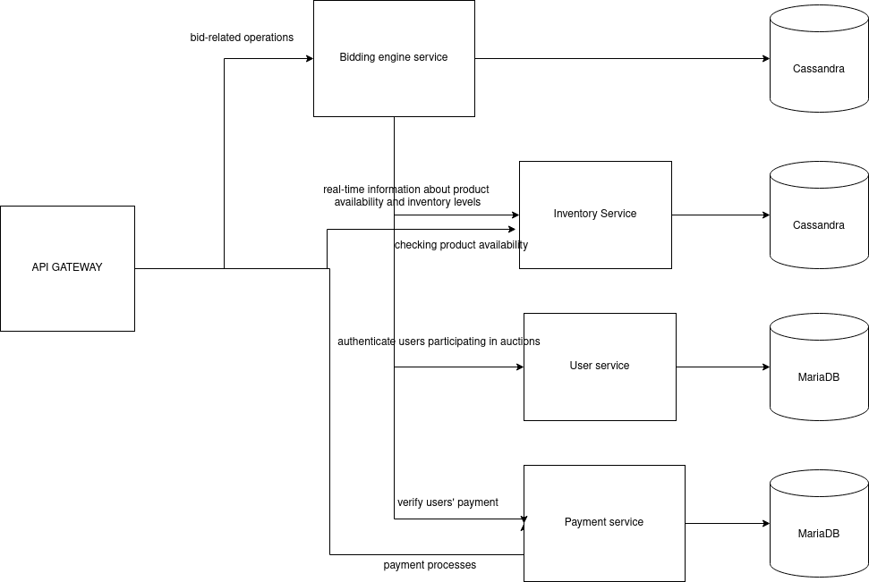

## LAB1-Ceckpoint 1
### Assess Application Suitability
1. **Real-Time Auctions**: The bidding engine and real-time updates are critical for auctions.
Microservices can handle bidding logic, real-time messaging, and auction management separately, 
ensuring responsiveness and reliability.
2. **Multiple User Roles**: The app has different user roles, including buyers, sellers, 
and administrators. Microservices can manage user roles and 
permissions separately, ensuring that each user group has a 
unique experience.
3. **Payment Service** Payment processing is a critical part of any marketplace.
A dedicated microservice can handle payment transactions, 
ensuring security and compliance with financial regulations.
4. **Seasonal Demand**: Agricultural markets often experience seasonal variations in supply and demand. Microservices can be
scaled up or down independently to handle fluctuations, 
ensuring optimal performance and resource utilization.
5. **Technological Stack**: By breaking down the application into microservices, it can be selected the best-suited programming 
languages and technologies for each service based on their specific 
requirements and strengths. For example:
   1. Java is a mature, reliable language with strong support for building authentication and authorization systems. 
   It's a common choice for handling user-related operations and security.
   2. Java's robustness and extensive libraries make it suitable for implementing complex business logic, such as real-time bidding and auction management.
   3. Go's performance and low-latency characteristics are advantageous for payment processing. It can handle transactions efficiently and securely.
   4. Go is known for its simplicity, efficiency, and scalability, making it a suitable choice for managing product listings. Its concurrency model is beneficial for handling concurrent product updates and searches.
6. **Separate database**:  Using a separate database for each microservice is another good reason for choosing 
a microservices architecture, especially when different services have distinct data requirements and when you want 
to achieve greater data isolation, scalability, and flexibility. For example:
   1. Relational databases are well-suited for storing user data, and they offer strong support for complex queries and data integrity.
   2. NoSQL databases can efficiently handle semi-structured product data, such as images and product descriptions, and are easily scalable.

### Define Service Boundaries

### Choose Technology Stack and Communication Patterns
#### Bidding engine service:
1. **Java** ava's robustness and extensive libraries make it suitable for implementing complex business logic, such as real-time bidding and auction management. 
2. **Spring Boot** Is there Java without Spring BOOT :-) 
3. **RabbitMq** Handles real-time messaging and broadcasting bidding updates to interested parties.
4. **Cassandra** Handles high write volumes and scalability, which are essential for tracking real-time bids and managing auction data. It's suitable for storing auction-related information.
5. **Redis** Can be used for caching frequently accessed data, such as ongoing auction details and user bidding information.
#### Inventory service:
1. **Go** is well-suited for building efficient, concurrent, and high-performance services, making it an excellent choice for real-time inventory management.
2. **Gin or Echo**: Use a lightweight and high-performance web framework like Gin or Echo to simplify the development of RESTful APIs for managing inventory data.
3. **Redis** Message queues are valuable for decoupling and load balancing tasks. The Inventory Service can publish inventory update events to a queue, and 
other services can consume these events to keep their data up-to-date
#### Payment service:
1. **Go** Go's performance and low-latency characteristics are advantageous for payment processing. It can handle transactions efficiently and securely.
2. **Circuit Braker** Implementing a circuit breaker can protect against overloading of the Payment Service when it's experiencing issues, ensuring that the rest of the application remains operational.
#### User service:
1. **Java** is a solid choice for the User Service, particularly when dealing with user authentication, authorization, 
and complex business logic related to user management. Java's extensive libraries and frameworks, such as Spring Security, can simplify these tasks.
2. **Spring Boot** Spring Boot simplifies the development of microservices
3. **MariaDB** Relational database like MariadDB or MySQL is useful for storing user data, profiles, and authentication-related information.

### Design Data Management
1. Place a Bid

   ```POST /api/bids/place```
   ```json
   {
    "user_id": "12345",
    "auction_id": "98765",
    "bid_amount": 100.00
   }
   ```
   Response
   ```json
   {
    "status": "success",
    "message": "Bid placed successfully",
    "bid_id": "54321"
   }

   ```
2. Get Bids for an Auction

   ```GET /api/bids/{auction_id}```
   
   Response
      ```json
      {
       "status": "success",
       "bids": [
         {
           "bid_id": "54321",
           "user_id": "12345",
           "bid_amount": 100.00,
           "timestamp": "2023-09-20T12:00:00Z"
         },
         {
           "bid_id": "54322",
           "user_id": "67890",
           "bid_amount": 110.00,
           "timestamp": "2023-09-20T12:05:00Z"
         }
       // More bid objects...
       ]
      }

   ```
3. Get Winning Bid for an Auction

   ```GET /api/bids/{auction_id}/winning```
 
   Response
      ```json
      {
         "status": "success",
         "winning_bid": {
           "bid_id": "54322",
           "user_id": "67890",
           "bid_amount": 110.00,
           "timestamp": "2023-09-20T12:05:00Z"
       }
      }
      ```

4. Register a User
```POST /api/auth/register```
```json
{
  "username": "john_doe",
  "email": "john.doe@example.com",
  "password": "my_secure_password"
}

```
```json
{
  "status": "success",
  "message": "User registered successfully",
  "user_id": "12345"
}
```
5. Get User Profile
```GET /api/users/{user_id}```

   Response
      ```json
   {
    "status": "success",
    "user_id": "12345",
    "username": "john_doe",
    "email": "john.doe@example.com",
    "created_at": "2023-09-20T12:00:00Z"
   }
      ```

6. Initiate Payment
```POST /api/payments/initiate```
```json
{
  "user_id": "12345",
  "auction_id": "98765",
  "amount": 100.00,
  "payment_method": "credit_card",
  "card_details": {
    "card_number": "**** **** **** 1234",
    "expiry_date": "12/25",
    "cvv": "123"
  }
}
```
7. Check Payment Status
```
GET /api/payments/{payment_id}
```
```json
{
  "status": "success",
  "payment_id": "54321",
  "transaction_status": "pending"
}
```

8. Add Product
```POST /api/products/add```
```json
{
  "product_name": "Example Product",
  "description": "This is an example product.",
  "price": 50.00,
  "quantity": 100
}
```
```json
{
  "status": "success",
  "message": "Product added successfully",
  "product_id": "12345"
}
```

9. Check Product Availability
```
GET /api/products/availability/{product_id}
```
```json
{
  "status": "success",
  "product_id": "12345",
  "product_name": "Example Product",
  "available_quantity": 75
}
```
```json
{
  "status": "error",
  "message": "Product not found",
  "error_code": "PRODUCT_NOT_FOUND"
}
```

10.  Create an Auction
```
POST /api/auctions/create
```
```json
{
  "seller_id": "12345",
  "product_id": "54321",
  "starting_price": 50.00,
  "reserve_price": 80.00,
  "start_time": "2023-09-25T14:00:00Z",
  "end_time": "2023-09-26T14:00:00Z"
}
```
```json
{
  "status": "success",
  "auction_id": "98765",
  "seller_id": "12345",
  "product_id": "54321",
  "starting_price": 50.00,
  "reserve_price": 80.00,
  "start_time": "2023-09-25T14:00:00Z",
  "end_time": "2023-09-26T14:00:00Z",
  "status": "active"
}
```

### Set Up Deployment and Scaling:
1. **Containerization and Orchestration**: Docker and Kubernetes.
Containerization is essential for microservices because it provides isolation, portability, and efficiency. It simplifies deployment, scaling, and ensures consistency across environments. Containers facilitate versioning, dependency management, and enhance security.
2. **Load Balancers**  NGINX distribute incoming traffic across multiple instances of a service to ensure even load distribution and high availability.
3. **Auto-Scaling** Auto-scaling groups automatically adjust the number of instances based on predefined criteria. For example 
the Payment Service may experience spikes in traffic when multiple users make payments simultaneously, such as when auctions end. Scaling this service horizontally ensures that payment processing remains efficient and reliable.